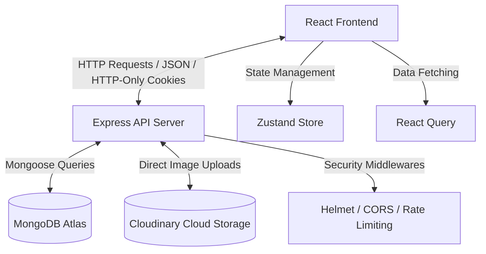

# ⚡ OptimusAutomate Blog App

<p align="center">
  
  
  
  
  
  
  
</p>

---

**OptimusAutomate Blog App** is a premium, full-stack, modern blog application designed with an immersive user interface, rich content editing, and robust security. Built using **React + Vite + Tailwind CSS** on the frontend, and **Node.js + Express + MongoDB** on the backend.

---

## ✨ Key Features

### 🎨 Frontend Experience (Client)
- **🎨 Glassmorphism & Rich Aesthetics**: Tailored modern UI using smooth gradients, curated color palettes, hover micro-animations, and full responsive design.
- **📝 Rich Text Editor**: Integrated **Tiptap Editor** with support for markdown shortcuts, link insertions, and dynamic image embeds.
- **💬 Interactive Engagement**:
  - Like/Unlike system with real-time visual feedback.
  - Bookmark/Save articles to your personalized library.
  - Hierarchical and interactive nested comment threads.
- **⚡ State Management**: Lightweight, super-fast global state using **Zustand**.
- **🔄 Data Fetching**: Optimistic updates, caching, and server-state sync via **TanStack React Query**.
- **🔔 Toast Notifications**: Smooth visual cues using **React Hot Toast**.

### 🔒 Backend Architecture (Server)
- **🔑 Robust Authentication**: JWT access tokens (short-lived) paired with secure, HTTP-only cookie-based refresh tokens (with rotation on reuse).
- **🛡️ Zod Schema Validation**: Strict verification of all incoming API payloads.
- **☁️ Secure Image Uploads**: Direct streaming and hosting integration with **Cloudinary** using **Multer**.
- **🛡️ Advanced Security Measures**:
  - **Helmet** for setting secure HTTP response headers.
  - **Express Rate Limit** to prevent brute-force attacks and abuse.
  - **Bcryptjs** for secure password hashing.
  - CORS-enabled whitelist protection.

---

## 🏗️ Architecture



---

## 🛠️ Technology Stack

### Frontend
- **Framework**: [React.js](https://react.dev/) (v18) with [Vite](https://vite.dev/) (v5)
- **Styling**: [Tailwind CSS](https://tailwindcss.com/) & Vanilla CSS variables
- **State Management**: [Zustand](https://github.com/pmndrs/zustand)
- **Data Fetching & Cache**: [React Query](https://tanstack.com/query/latest)
- **Rich Text Editor**: [Tiptap](https://tiptap.dev/)
- **Icons**: [Lucide React](https://lucide.dev/)

### Backend
- **Runtime**: [Node.js](https://nodejs.org/) (v18+)
- **Framework**: [Express.js](https://expressjs.com/) (v4)
- **Database Wrapper**: [Mongoose](https://mongoosejs.com/) (MongoDB)
- **Validation**: [Zod](https://zod.dev/)
- **Security**: [Helmet](https://helmetjs.github.io/), [CORS](https://github.com/expressjs/cors), [Express Rate Limit](https://github.com/express-rate-limit/express-rate-limit), [bcryptjs](https://github.com/dcodeIO/bcrypt.js)

---

## ⚙️ Quick Start

### Prerequisites
Make sure you have Node.js (v18+) and MongoDB installed on your system or use MongoDB Atlas.

### 1. Server Configuration
1. Navigate to the server directory:
   ```bash
   cd server
   ```
2. Copy the environment template and set up your variables:
   ```bash
   cp .env.example .env
   ```
3. Open `.env` and fill in the required fields:
   *   `MONGODB_URI`: Your MongoDB connection string.
   *   `JWT_SECRET` & `JWT_REFRESH_SECRET`: Secure cryptographic keys for authentication.
   *   `CLIENT_URL`: `http://localhost:5173` (default client URL).
   *   `CLOUDINARY_CLOUD_NAME`, `CLOUDINARY_API_KEY`, `CLOUDINARY_API_SECRET`: Your Cloudinary connection tokens.
4. Install backend dependencies:
   ```bash
   npm install
   ```
5. Start the backend development server:
   ```bash
   npm run dev
   ```

### 2. Client Configuration
1. Navigate to the client directory:
   ```bash
   cd ../client
   ```
2. Copy the environment template:
   ```bash
   cp .env.example .env
   ```
3. Configure the environment variable:
   *   `VITE_API_URL`: `http://localhost:5000/api` (default server URL).
4. Install frontend dependencies:
   ```bash
   npm install
   ```
5. Start the client development server:
   ```bash
   npm run dev
   ```

---

## 📂 Project Structure

```text
├── client/                     # React Frontend Application (Vite)
│   ├── src/
│   │   ├── components/         # Layout, UI, Auth, and Blog components
│   │   ├── hooks/              # Custom React hooks (Auth, Uploads, Posts)
│   │   ├── pages/              # Main routing view pages (Home, Auth, Profile, settings, etc.)
│   │   ├── services/           # Axios API services and theme management
│   │   ├── store/              # Zustand global state stores (auth, bookmarks, theme)
│   │   ├── utils/              # Utilities (formatDate, readingTime)
│   │   └── App.jsx             # Main routing and layout configuration
│   └── package.json            
│
└── server/                     # Express Backend API Server
    ├── src/
    │   ├── config/             # Database and Cloudinary configurations
    │   ├── controllers/        # Route controllers containing business logic
    │   ├── middleware/         # Auth, rate-limiter, validator, and error middlewares
    │   ├── models/             # Mongoose schemas (User, Post, Comment)
    │   └── routes/             # Express Route definitions
    └── package.json            
```

---

## 🔌 API Routes Reference

### Authentication Routes
*Endpoint prefix:* `/api/auth`

| Method | Endpoint | Description | Auth Required |
| :--- | :--- | :--- | :---: |
| `POST` | `/register` | Register a new user | ❌ |
| `POST` | `/login` | Log in and set HTTP-only token cookie | ❌ |
| `POST` | `/logout` | Clear token cookie and log out user | ❌ |
| `POST` | `/refresh` | Refresh expired JWT access token | ❌ |
| `GET` | `/me` | Get current logged-in user profile details | ✔️ |
| `PUT` | `/profile` | Update user bio, password, or avatar | ✔️ |
| `GET` | `/authors` | Get list of top authors | ❌ |
| `GET` | `/profile/:username`| Get a user profile by username | ❌ |

### Blog Post Routes
*Endpoint prefix:* `/api/posts`

| Method | Endpoint | Description | Auth Required |
| :--- | :--- | :--- | :---: |
| `GET` | `/` | Retrieve all posts (supports drafts for auth) | ❌ / ✔️ |
| `GET` | `/:slugOrId` | Get a specific blog post by slug or ID | ❌ / ✔️ |
| `POST` | `/` | Create a new blog post | ✔️ |
| `PUT` | `/:id` | Update an existing blog post | ✔️ |
| `DELETE`| `/:id` | Delete a blog post | ✔️ |
| `POST` | `/:id/like` | Toggle like/unlike on a post | ✔️ |
| `POST` | `/upload` | Upload cover/inline images to Cloudinary | ✔️ |

### Comment Routes
*Endpoint prefix:* `/api/comments`

| Method | Endpoint | Description | Auth Required |
| :--- | :--- | :--- | :---: |
| `GET` | `/:postId` | Retrieve comments for a specific post | ❌ |
| `POST` | `/:postId` | Create a comment under a post | ✔️ |
| `DELETE`| `/:id` | Delete a comment | ✔️ |
| `POST` | `/:id/like` | Toggle like/unlike on a comment | ✔️ |

---

## 🛡️ Security Implementation Notes

> [!IMPORTANT]
> **Authentication Token Strategy**: OptimusAutomate Blog App implements secure cookie-based JWT authorization using HTTP-Only and SameSite configurations to mitigate Cross-Site Scripting (XSS) and Cross-Site Request Forgery (CSRF) vulnerabilities.

> [!TIP]
> **Rate Limiting**: Rate limiters are actively configured on sensitive routes such as `/api/auth/register`, `/api/auth/login`, and `/api/posts/upload` to secure the system against brute-force attacks.

> [!WARNING]
> **Helmet Integration**: Helmet HTTP headers are integrated out-of-the-box to prevent Clickjacking, MIME type sniffing, and secure user agent connections.

---

## 📄 License
Distributed under the MIT License. See `server/package.json` for license details.
